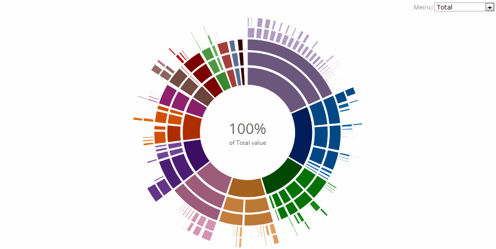

<h1 align="center">Hi 👋, I'm varun</h1>
<h3 align="center">The Life and Work of a Program Developer</h3>

  

- 🌱 I’m currently learning **java , Android Studio**

- 📫 How to reach me **varunraguraman@gmail.com**

- ⚡ Fun fact **Computer programming played an important role in ending World War II.**
- # About Me

Hello there! 👋 I'm   VARUN S , and this is my GitHub repository.

## Professional Background

- I attended a campus interview and was placed in **MSPACE DRONE TECHNOLOGY**.
- I worked at MSPACE DRONE TECHNOLOGY, where I gained valuable knowledge as a software developer, focusing on **Mapping and Image Processing**.

## Experience Highlights

- **Company:** MSPACE DRONE TECHNOLOGY
- **Role:** Software Developer
- **Specialization:** Mapping and Image Processing

## Achievements

- Successfully contributed to projects involving mapping and image processing.
- Gained hands-on experience in software development within the drone technology domain.
- Developed skills in various aspects of mapping and image processing.

## Contact

Feel free to reach out if you have any questions or would like to connect:

- Email: your.email@example.com
- LinkedIn: [Varun S](www.linkedin.com/in/
varun-s-96b2b529b
)

Looking forward to sharing and collaborating on exciting projects! 🚀

<h3 align="left">Connect with me:</h3>

<h3 align="left">Languages and Tools:</h3>

       

&nbsp;

